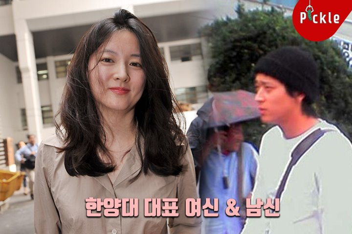

【2018.01.03】【新闻】 汉阳大学入学仪式       
2018年，毕业于汉阳大学跨学科研究系的李英爱将在研究生院攻读博士后课程。        
       
(提示：右击视频，勾选“显示控件”，可控制播放。也可右击另存为视频下载)[视频地址](https://video.h5.weibo.cn/1034:344deaaf4f1c4eec601829ef64fd3e10/4192171475350508)
