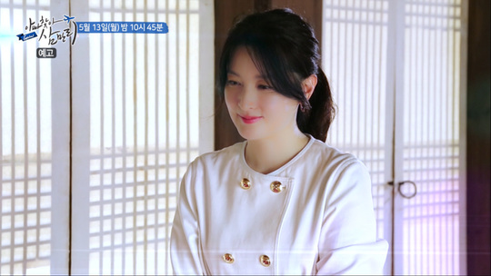
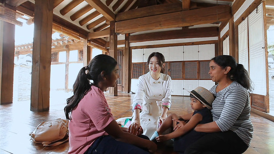
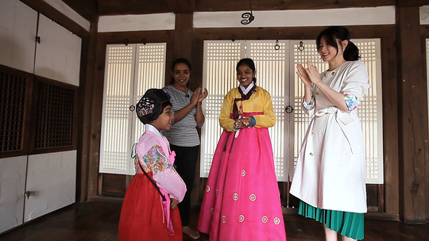
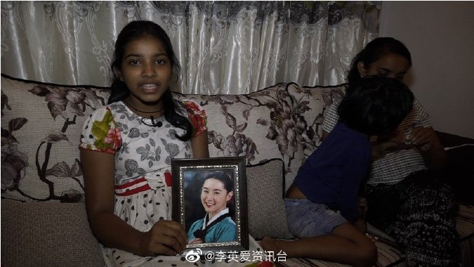

【2019.05.10】【新闻】李英爱与“大长今”的粉丝，一个斯里兰卡的女孩见面           
<video style="width: 565px; height: 317.8125px; background: #000;" src="https://gss3.baidu.com/6LZ0ej3k1Qd3ote6lo7D0j9wehsv/tieba-smallvideo-transcode/8746911_08fbdf60a0d46c6c3961260c09960235_0.mp4" data-threadid="6127287676" data-md5="08fbdf60a0d46c6c3961260c09960235" controls="" autoplay=""></video>             

             

李英爱与斯里兰卡的一个家族进行了特别会面。        
5月10日，EBS 1TV'Global Daddy寻找第三人'，李英爱惊讶地出现。      
由于她的第一个女儿Sanjana（12岁）和她的第二个女儿Finidhi（4岁）出生为女儿，爸爸去韩国做婚礼嫁妆。在斯里兰卡，妇女在结婚时仍然需要嫁妆，而一个不能嫁妆的妇女也可能面临生命危险。此外，由于妇女的参与率很低，实际上很难打破嫁妆的做法，当我结婚并把财产带给我的女儿时，嫁妆夺走了我的财产。             
              
Sanganja是一名住在斯里兰卡的12岁女孩。但是，现在青少年正处于梦想的开始阶段，她正梦想着自己的梦想。我将努力学习，并作为一个有事业的有尊严的女人生活。
这是MBC电视剧“Dae Jang Geum”，Sanjana可以有自己的梦想。在大长今，自豪地成功克服各种逆境的以男性为造船故事的国家，试图开拓出一个新的生命的宝石时都发挥自己的希望和愿望。                   
当我研究Sanjana时，我看了大约10次“Daejanggeum”，并且在我的桌子前放了很多Daejanggeum的照片。当它很难或很累时，'Daejanggum'的主题被称为'Onara'，它具有自我毁灭性。感谢她的妹妹，她4岁的妹妹Pinnie即将寄出一颗巨大的宝石。                  
“Dae Jang Geum”于2013年在斯里兰卡播出并录得99％的惊人评级，仍然通过YouTube为斯里兰卡少女带来新的梦想和愿望。              
              
Dae Jang Geum女演员Lee Young-ae愿意与她的家人见面Sanjana。Lee Young-ae的12岁女孩告诉她如何生活得令人眼花缭乱，呈现Hanbok后令人印象深刻的时间将在5月13日揭晓。（照片=由EBS提供）           
     
ⓒNewsen
