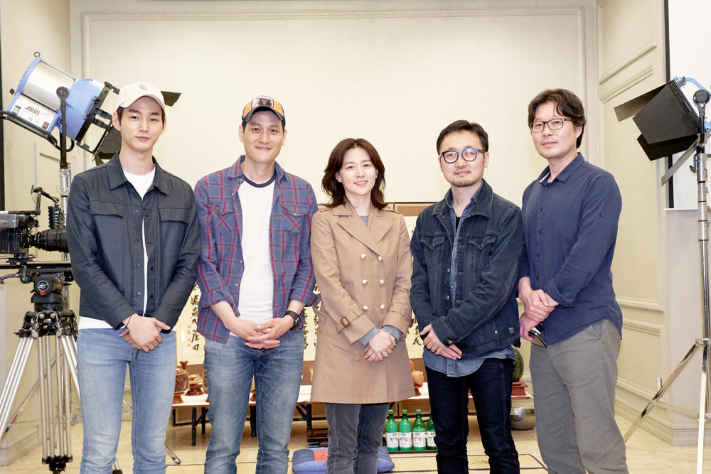

2019年即将上映最新作品《来找我(2019)》剧照       

----------------------------------------------------------------------------------------------------------------------------------------
**资讯发布区**    
1.关注微博：**李英爱资讯台** (建议使用“微博国际版”APP，再查看此主页下的所有微博，就可以过滤掉所有与李英爱无关的点赞和评论动态。）     
2.关注Instagram：**leeyoungae_club**    
3.关注微信公众号：**时越之爱**      
            

----------------------------------------------------------------------------------------------------------------------------------------
**核心粉丝区**      
**[韩剧网](http://www.2hanju.com/)** （强烈建议PC访问，浏览器允许Flash播放。2000年前，2003，2015年为李英爱的《火花》《医家兄弟》《大长今》《师任堂：光的日记》等等韩剧所在时间分区。)            

----------------------------------------------------------------------------------------------------------------------------------------
**聊天唠嗑区**          
李英爱的粉丝1群，使用微博客户端扫描下方二维码加入：       
           
**[站主私人](http://file.leeyoungae.club)**         

--------------------------------------------------------------------------------------------------------------------------------------- 
**2019**      
[【2019.03.15】【新闻】JTBC movieroom《氧气美女李英爱》](./2019/2019.03.15/2019.03.15.a.md)      
[【2019.03.13】【新闻】ICON STUDIO邀请李英爱录制节目](./2019/2019.03.13/2019.03.13.a.md)               
[【2019.03.06】【广告】Whoo CF](./2019/2019.03.06/2019.03.06.a.md)        
[【2019.03.02】【广告】Whoo CF](./2019/2019.03.02/2019.03.02.a.md)           
[【2019.02.23】【新闻】网友在商场偶遇李英爱](./2019/2019.02.23/2019.02.23.a.md)     
[【2019.02.22】【新闻】视讯中国对近期李英爱新写真报道](./2019/2019.02.22/2019.02.22.a.md)    
[【2019.02.21】【广告】3月《ELLE Korea》](./2019/2019.02.21/2019.02.21.a.md)     
[【2019.02.21】【新闻】联合国教科文组织韩国委员会特别亲善大使李英爱，负责《小王子》韩语朗读录制工作](./2019/2019.02.21/2019.02.21.b.md)     
[【2019.02.20】【广告】 Kyowon Wells the One Ad](./2019/2019.02.20/2019.02.20.a.md)     
[【2019.02.17】【新闻】网友于狎鸥亭现代百货内偶遇英爱](./2019/2019.02.17/2019.02.17.a.md)      
[【2019.02.16】【新闻】蜡像馆（哈哈，还挺像的)](./2019/2019.02.16/2019.02.16.a.md)    
[【2019.02.12】【新闻】网友与远处李英爱勉强合影ㄟ( ▔, ▔ )ㄏ](./2019/2019.02.12/2019.02.12.a.md)          
[【2019.02.11】【新闻】网友与李英爱合照](./2019/2019.02.11/2019.02.11.a.md)       
[【2019.01.18】【新闻】网友网友于音乐剧上偶遇英爱](./2019/2019.01.18/2019.01.18.a.md)   
[【2019.01.18】【新闻】书籍发售：수선화에게 정호승 시선집 - 2019/1/18发售](./2019/2019.01.18/2019.01.18.b.md)    
[【2019.01.13】【广告】 Kyowon wells the one CF 30s"](./2019/2019.01.13/2019.01.13.a.md)    
[【2019.01.08】【新闻】19年后台历，美哭](./2019/2019.01.08/2019.01.08.a.md)       
[【2019.01.04】【新闻】 对韩一线艺人广告的集锦回顾 李英爱02：45处](./2019/2019.01.04/2019.01.04.a.md)     
[【2019.01.01】【广告】  Whoo 秘贴 CF ver.2](./2019/2019.01.01/2019.01.01.a.md)    

----------------------------------------------------------------------------------------------------------------------------------------
**2018**       
[【2018.12.31】【广告】 Kyowon Wells tt](./2018/2018.12.31/2018.12.31.a.md)     
[【2018.12.22】【广告】 天气丹CF ver.2](./2018/2018.12.22/2018.12.22.a.md)    
[【2018.11.30】【新闻】 同网友合影](./2018/2018.11.30/2018.11.30.a.md)    
[【2018.11.22】【广告】The history of Whoo Luxury Lipstick CF 1080P](./2018/2018.11.22/2018.11.22.a.md)       
[【2018.11.09】【新闻】李英爱出席前辈追悼会](./2018/2018.11.09/2018.11.09.a.md)     
[【2018.11.07】【新闻】 出席Whoo活动 1080P](./2018/2018.11.07/2018.11.07.a.md)      
[【2018.10.30】【广告】 Whoo CF](./2018/2018.10.30/2018.10.30.a.md)     
[【2018.10.22】【广告】 illuma Ad](./2018/2018.10.22/2018.10.22.a.md)     
[【2018.10.11】【新闻】韩剧《大长今在看着》致敬《大长今》](./2018/2018.10.11/2018.10.11.a.md)     
[【2018.10.12】【新闻】  网友偶遇李英爱](./2018/2018.10.12/2018.10.12.a.md)   
[【2018.10.10】【广告】 Lyanature CF](./2018/2018.10.10/2018.10.10.a.md)      
[【2018.10.09】【广告】  Whoo CF](./2018/2018.10.09/2018.10.09.a.md)      
[【2018.10.01】【新闻】网友于杨平偶遇英爱](./2018/2018.10.01/2018.10.01.a.md)      
[【2018.09.25】【综艺】俘获芳心》试播期完整版](./2018/2018.09.25/2018.09.25.a.md)    
[【2018.07.29】【新闻】泰国儿童嘉年华,李英爱与网友合照](./2018/2018.07.29/2018.07.29.a.md)      
[【2018.05.24】【新闻】 李英爱夫妇与网友合照](./2018/2018.05.24/2018.05.24.a.md)     
[【2018.05.16】【新闻】大荧幕《나를 찾아줘 /找到我/来找我》开拍](./2018/2018.05.16/2018.05.16.a.md)    
[【2018.05.15】【广告】 The history of Whoo Luxury Lipstick CF 30s"](./2018/2018.05.15/2018.05.15.a.md)     
[【2018.05.10】【新闻】illuma-3 Mother's Day](./2018/2018.05.10/2018.05.10.a.md)     

----------------------------------------------------------------------------------------------------------------------------------------
**2017**     
[【2017.12.17】【综艺】短片《楼下房间》](./2017/2017.12.17/2017.12.17.a.md)      

----------------------------------------------------------------------------------------------------------------------------------------
**2016**            
[【2016.09.16】【综艺】SBSSBS中秋李英爱特辑节目《歌唱的明星》](./2016/2016.09.16/2016.09.16.a.md)      

----------------------------------------------------------------------------------------------------------------------------------------
**2015**      
[【2015.11.06】【新闻】《请回答1988》致敬李英爱](./2015/2015.11.06/2015.11.06.a.md)    
[【2015.12.17】【新闻】李英爱为电影《我的儿子，我的母亲（2012）》应援推荐](./2015/2015.12.17/2015.12.17.a.md)    

----------------------------------------------------------------------------------------------------------------------------------------
**2014**             
[【2014.09.20】【纪录片】TVB 真情真我李英爱](./2014/2014.09.20/2014.09.20.a.md)      
[【2014.09.10】【新闻】 COSMOPOLITAN HK](./2014/2014.09.10/2014.09.10.a.md)     

----------------------------------------------------------------------------------------------------------------------------------------
**2013**           
[【2013.10.17】【新闻】李英爱蒙古拍摄写真](./2013/2013.10.17/2013.10.17.a.md)     
[【2013.09.18】【新闻】李英爱被任命为Gucci全球竞选活动的顾问。](./2013/2013.09.18/2013.09.18.a.md)    
[【2013.05.23】【纪录片】SBS李英爱的晚餐](./2013/2013.05.23/2013.05.23.a.md)        
[【2013.05.23】【纪录片】李英爱的晚餐春节特辑花絮](./2013/2013.05.23/2013.05.23.b.md)     
[【2013.05.01】【新闻】 《李英爱的晚餐》意大利录制期间，与韩方工作人员合影](./2013/2013.05.01/2013.05.01.a.md)    

----------------------------------------------------------------------------------------------------------------------------------------
**2012**      
[【2012.08.01】【新闻】学插花的老李，人比花娇花无色](./2012/2012.08.01/2012.08.01.a.md)    

----------------------------------------------------------------------------------------------------------------------------------------
**2008**        
[【2008.09.26】【纪录片】MBC纪录片 我是李英爱](./2008/2008.09.26/2008.09.26.a.md)     

----------------------------------------------------------------------------------------------------------------------------------------
**2007**     
[【2007.09.23】【广告】血槽已空(￣m￣)](./2007/2007.09.23/2007.09.23.a.md)     

----------------------------------------------------------------------------------------------------------------------------------------
**2006**     
[【2006.02.09】【新闻】担任柏林电影节评委的夏洛特·兰普林与李英爱](./2006/2006.02.09/2006.02.09.a.md)   
[【2006.02.02】【新闻】英国杂志《TheList》对《亲切的金子》报道](./2006/2006.02.02/2006.02.02.a.md)      

----------------------------------------------------------------------------------------------------------------------------------------
**2005**         
[【2005.11.01】【新闻】电影杂志对《亲切的金子》的报道](./2005/2005.11.01/2005.11.01.a.md)     
[【2005.05.01】【CF】哈哈这个CF每次看都想笑，咱老李终于攻了一回。](./2005/2005.05.01/2005.05.01.a.md)     

----------------------------------------------------------------------------------------------------------------------------------------
**2004**       
[【2004.10.08】【新闻】釜山电影节李英爱与梁朝伟，现场视频](./2004/2004.10.08/2004.10.08.a.md)       
[【2004.10.08】【新闻】釜山电影节李英爱与梁朝伟，现场图片](./2004/2004.10.08/2004.10.08.b.md)        
[【2004.05.26】【综艺】《娱乐百分百》李英爱与大小S姐妹](./2004/2004.05.26/2004.05.26.a.md)        
[【2004.03.30】【综艺】《大长今》 P1特典](./2004/2004.03.30/2004.03.30.a.md)       
[【2004.03.30】【综艺】《大长今》P2庆功宴](./2004/2004.03.30/2004.03.30.b.md)   
[【2004.03.30】【综艺】《大长今》 P3采访导演](./2004/2004.03.30/2004.03.30.c.md)       
[【2004.03.30】【综艺】《大长今》P4 NG1](./2004/2004.03.30/2004.03.30.d.md)          
[【2004.03.30】【综艺】《大长今》P4 NG2](./2004/2004.03.30/2004.03.30.e.md)     
[【2004.03.30】【综艺】《大长今》P5 制作特辑](./2004/2004.03.30/2004.03.30.f.md)      
[【2004.03.29】【剧照】《大长今》官方剧照](./2004/2004.03.29/2004.03.29.a.md)    

----------------------------------------------------------------------------------------------------------------------------------------
**2000**        
[【2000.09.10】【制作特辑】《共同警备区》制作特辑](./2000/2000.09.10/2000.09.10.a.md)        
[【2000.09.09】【剧照】《共同警备区》](./2000/2000.09.09/2000.09.09.a.md)     

----------------------------------------------------------------------------------------------------------------------------------------
**1999**          
[【1999.05.30】【纪录片】KBS2 地理探索者](./1999/1999.05.30/1999.05.30.a.md)     

----------------------------------------------------------------------------------------------------------------------------------------
**1998**    
[【1998.11.16】【纪录片】李英爱全真影音日记。](./1998/1998.11.16/1998.11.16.a.md)      
[【1998.06.01】【新闻】 杂志图片](./1998/1998.06.01/1998.06.01.a.md)    

----------------------------------------------------------------------------------------------------------------------------------------
**1994**   
[【1994.03.21】【综艺】 1994年一展歌喉+MC（真的没啥唱歌天赋了）ㄟ( ▔, ▔ )ㄏ](./1994/1994.03.21/1994.03.21.a.md)       
[【1994.01.01】【新闻】香粧杂志封面人物，李英爱](./1994/1994.01.01/1994.01.01.a.md)      

----------------------------------------------------------------------------------------------------------------------------------------
**1993**     
[【1993.06.01】【电视剧剪辑】1993年出道作你家的老公如何片头](./1993/1993.06.01/1993.06.01.a.md)      

----------------------------------------------------------------------------------------------------------------------------------------

